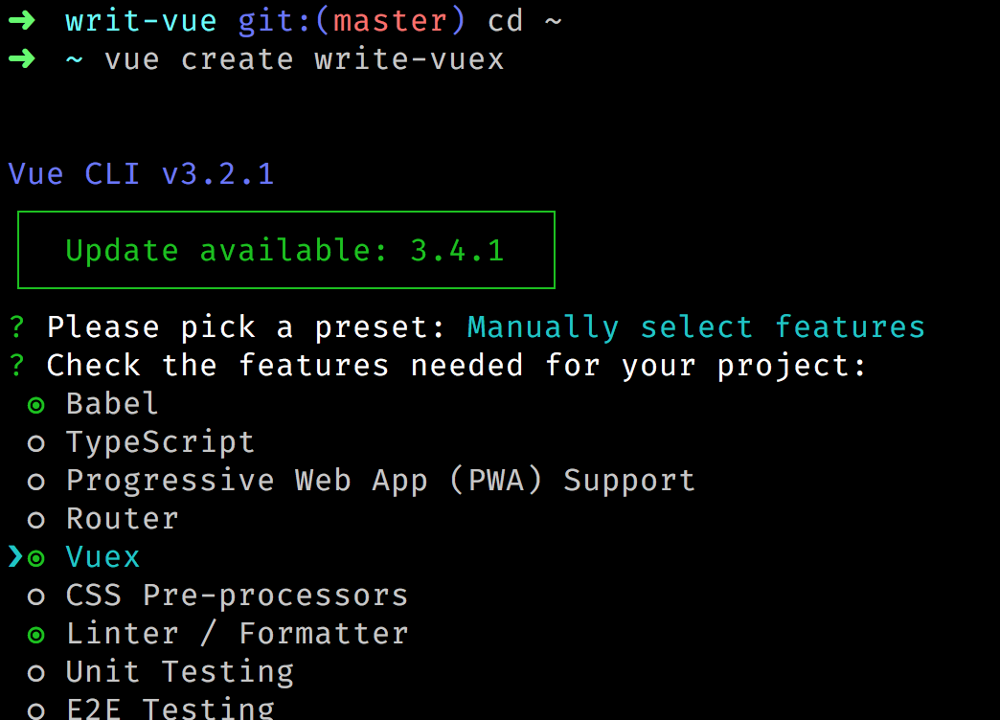
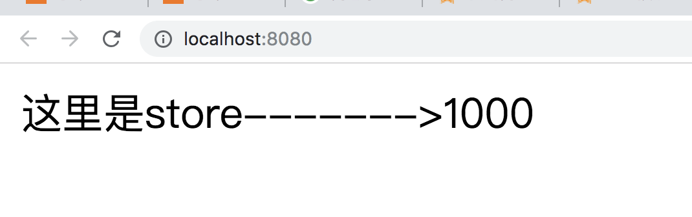
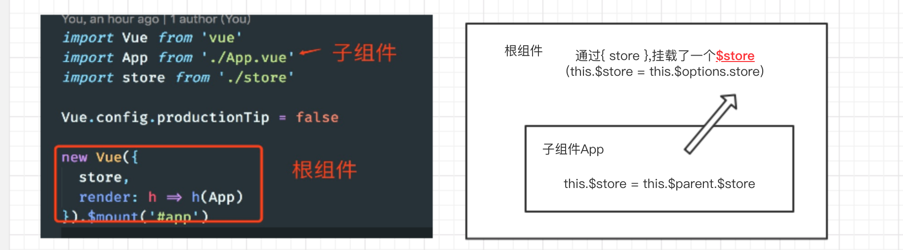
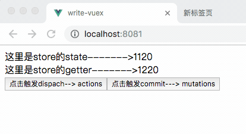
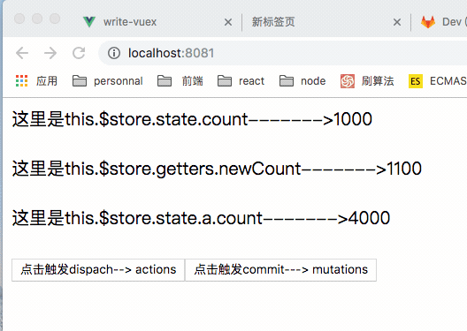

大家都知道`vuex`是`vue`的一个状态管理器，它采用集中式存储管理应用的所有组件的状态，并以相应的规则保证状态以一种可预测的方式发生变化。先看看`vuex`下面的工作流程图


通过官方文档提供的流程图我们知道，`vuex`的工作流程，

* 1、数据从`state`中渲染到页面；
* 2、在页面通过`dispatch`来触发`action`；
* 3、`action`通过调用`commit`,来触发`mutation`；
* 4、`mutation`来更改数据，数据变更之后会触发`dep`对象的`notify`，通知所有`Watcher`对象去修改对应视图（vue的双向数据绑定原理）。


### 使用vuex

理解`vuex`的工作流程我们就看看`vuex`在`vue`中是怎么使用的。

首先用`vue-cli`创建一个项目工程，如下图，选择`vuex`，然后就是一路的回车键



安装好之后，就有一个带有v`uex`的`vue`项目了。

进入目录然后看到，`src/store.js`，在里面加了一个状态`{count: 100}`，如下

````js
import Vue from 'vue'
import Vuex from 'vuex' // 引入vuex

Vue.use(Vuex) // 使用插件

export default new Vuex.Store({
  state: {
    count: 100 // 加一个状态
  },
  getter: {
  
  },
  mutations: {
  
  },
  actions: {
  
  }
})
````

最后在App.vue文件里面使用上这个状态，如下

````html
<template>
  <div id="app">
    这里是stort------->{{this.$store.state.count}}
  </div>
</template>

<script>
export default {
  name: 'app'
}
</script>

<style>
</style>
````

项目跑起来就会看到页面上看到，页面上会有100了，如下图



到这里我们使用`vuex`创建了一个`store`，并且在我们的App组件视图中使用，但是我们会有一些列的疑问。

* `store`是如何被使用到各个组件上的？？
* 为什么`state`的数据是双向绑定的？？
* 在组件中为什么用`this.$store.dispch`可以触发`store`的`actions`？？
* 在组件中为什么用`this.$store.commit`可以触发`store`的`mutations`？？
* ....等等等等

带着一堆问题，我们来自己实现一个vuex，来理解vuex的工作原理。

### 安装并使用store

在src下新建一个vuex.js文件，然后代码如下

````js
'use strict'

let Vue = null

class Store {
  constructor (options) {
    let { state, getters, actions, mutations } = options
  }
}
// Vue.use(Vuex)
const install = _Vue => {
  // 避免vuex重复安装
  if (Vue === _Vue) return
  Vue = _Vue
  Vue.mixin({
    // 通过mixins让每个组件实例化的时候都会执行下面的beforeCreate
    beforeCreate () {
      // 只有跟节点才有store配置，所以这里只走一次
      if (this.$options && this.$options.store) {
        this.$store = this.$options.store
      } else if (this.$parent && this.$parent.$store) { // 子组件深度优先 父 --> 子---> 孙子
        this.$store = this.$parent.$store
      }
    }
  })
}

export default { install, Store }
````

然后修改`store.js`中的引入vuex模块改成自己的vuex.js

`import Vuex from './vuex' // 自己创建的vuex文件`

在我们的代码中`export default { install, Store }`导出了一个对象，分别是`install`和`Store`

`install`的作用是，当`Vue.use(Vuex)`就会自动调用`install`方法，在`install`方法里面，我们用`mixin`混入了一个`beforeCreate`的生命周期的钩子函数，使得当每个组件实例化的时候都会调用这个函数。

在`beforeCreate`中，第一次根组件通过`store`属性挂载`$store`，后面子组件调用`beforeCreate`挂载的`$store`都会向上找到父级的`$store`，这样子通过层层向上寻找，让每个组件都挂上了一个`$store`属性，而这个属性的值就是我们的`new Store({...})`的实例。如下图



>通过层层向上寻找，让每个组件都挂上了一个`$store`属性

### 设置state响应数据

通过上面，我们已经从每个组件都通过`this.$store`来访问到我们的store的实例，下面我们就编写state数据，让其变成双向绑定的数据。下面我们改写store类

````js
class Store {
  constructor (options) {
    let { state, getters, actions, mutations } = options // 拿到传进来的参数
    this.getters = {}
    this.mutations = {}
    this.actions = {}
    // vuex的核心就是借用vue的实例，因为vuex的数据更改回更新视图
    this._vm = new Vue({
      data: {
        state
      }
    })
  }
  // 访问state对象时候，就直接返回响应式的数据
  get state() { // Object.defineProperty get 同理
    return this._vm.state
  }
}
````

传进来的state对象，通过new Vue({data: {state}})的方式，让数据变成响应式的。当访问state对象时候，就直接返回响应式的数据，这样子在App.vue中就可以通过`this.$store.state.count`拿到state的数据啦，并且是响应式的呢。

### 编写mutations、actions、getters

上面我们已经设置好state为响应式的数据，这里我们在store.js里面写上mutations、actions、getters，如下

````js
import Vue from 'vue'
import Vuex from './vuex' // 引入我们的自己编写的文件

Vue.use(Vuex) // 安装store
// 实例化store，参数数对象
export default new Vuex.Store({
  state: {
    count : 1000
  },
  getters : {
    newCount (state) {
      return state.count + 100
    }
  },
  mutations: {
    change (state) {
      console.log(state.count)
      state.count += 10
    }
  },
  actions: {
    change ({commit}) {
      // 模拟异步
      setTimeout(() => {
        commit('change')
      }, 1000)
    }
  }
})
````
配置选项都写好之后，就看到getters对象里面有个newCount函数，mutations和actions对象里面都有个change函数，配置好store之后我们在App.vue就可以写上，dispatch和commit，分别可以触发actions和mutations，代码如下

````html
<template>
  <div id="app">
    这里是store的state------->{{this.$store.state.count}} <br/>
    这里是store的getter------->{{this.$store.getters.newCount}} <br/>
    <button @click="change">点击触发dispach--> actions</button>
    <button @click="change1">点击触发commit---> mutations</button>
  </div>
</template>

<script>
export default {
  name: 'app',
  methods: {
    change () {
      this.$store.dispatch('change') // 触发actions对应的change
    },
    change1 () {
      this.$store.commit('change') // 触发mutations对应的change
    }
  },
  mounted () {
    console.log(this.$store)
  }
}
</script>
````
数据都配置好之后，我们开始编写store类，在此之前我们先编写一个循环对象工具函数。如下
````js
const myforEach = (obj, callback) => Object.keys(obj).forEach(key => callback(key, obj[key]))
// 作用：
// 例如{a: '123'}， 把对象的key和value作为参数
// 然后就是函数运行callback(a, '123')
````

工具函数都准备好了，之后，下面直接县编写getters、mutations和actions的实现

````js
class Store {
  constructor (options) {
    let { state = {}, getters = {}, actions = {}, mutations = {} } = options
    this.getters = {}
    this.mutations = {}
    this.actions = {}
    // vuex的核心就是借用vue的实例，因为vuex的数据更改回更新视图
    this._vm = new Vue({
      data: {
        state
      }
    })
    // 循环getters的对象
    myforEach(getters, (getterName, getterFn) => {
      // 对this.getters对象进行包装，和vue的computed是差不多的
      // 例如 this.getters['newCount'] = fn(state)
      // 执行 this.getters['newCount']()就会返回计算的数据啦
      Object.defineProperty(this.getters, getterName, {
        get: () => getterFn(state)
      })
    })
    // 这里是mutations各个key和值都写到，this.mutations对象上面
    // 执行的时候就是例如：this.mutations['change']()
    myforEach(mutations, (mutationName, mutationsFn) => {
      // this.mutations.change = () => { change(state) }
      this.mutations[mutationName] = () => {
        mutationsFn.call(this, state)
      }
    })
    // 原理同上
    myforEach(actions, (actionName, actionFn) => {
      // this.mutations.change = () => { change(state) }
      this.actions[actionName] = () => {
        actionFn.call(this, this)
      }
    })
    const {commit , dispatch} = this // 先存一份，避免this.commit会覆盖原型上的this.commit
    // 解构 把this绑定好
    // 通过结构的方式也要先调用这类，然后在下面在调用原型的对应函数
    this.commit = type => {
      commit.call(this, type)
    }
    this.dispatch = type => {
      dispatch.call(this, type)
    }
  }
  get state() { // Object.defineProperty 同理
    return this._vm.state
  }
  // commi调用
  commit (type) {
    this.mutations[type]()
  }
  // dispatch调用
  dispatch (type) {
    this.actions[type]()
  }
}

````
通过上面的，我们可以看出，其实`mutations`和`actions`都是把传入的参数，赋值到`store`实例上的`this.mutations`和`this.actions`对象里面。

当组件中`this.$store.commit('change')`的时候 其实是调用`this.mutations.change(state)`，就达到了改变数据的效果，`actions`同理。

getters是通过对`Object.defineProperty(this.getters, getterName, {})`
对this.getters进行包装当组件中`this.$store.getters.newCount`其实是调用`getters`对象里面的`newCount(state)`，然后返回计算结果。就可以显示到界面上了。

大家看看完成后的效果图。



到这里大家应该懂了vuex的内部代码的工作流程了，vuex的一半核心应该在这里了。为什么说一半，因为还有一个核心概念module，也就是vuex的数据的模块化。

### vuex数据模块化

由于使用单一状态树，应用的所有状态会集中到一个比较大的对象。当应用变得非常复杂时，store 对象就有可能变得相当臃肿。

为了解决以上问题，Vuex 允许我们将 store 分割成模块（module）。每个模块拥有自己的 state、mutation、action、getter、甚至是嵌套子模块——从上至下进行同样方式的分割

例如下面的`store.js`

````js
// 实例化store，参数数对象
export default new Vuex.Store({
  modules: {
    // 模块a
    a: {
      state: {
        count: 4000
      },
      actions: {
        change ({state}) {
          state.count += 21
        }
      },
      modules: {
        // 模块b
        b: {
          state: {
            count: 5000
          }
        }
      }
    }
  },
  state: {
    count : 1000
  },
  getters : {
    newCount (state) {
      return state.count + 100
    }
  },
  mutations: {
    change (state) {
      console.log(state.count)
      state.count += 10
    }
  },
  actions: {
    change ({commit}) {
      // 模拟异步
      setTimeout(() => {
        commit('change')
      }, 1000)
    }
  }
})
````

然后就可以在界面上就可以写上`this.$store.state.a.count(显示a模块count)`，`this.$store.state.a.b.count(显示a模块下，b模块的count)`，这里还有一个要注意的，其实在组件中调用`this.$store.dispatch('change')`会同时触发，根的actions和a模块的actions里面的`change`函数。

下面我们就直接去实现models的代码，也就是整个vuex的实现代码，

````js
'use strict'

let Vue = null
const myforEach = (obj, callback) => Object.keys(obj).forEach(key => callback(key, obj[key]))

class Store {
  constructor (options) {
    let state = options.state
    this.getters = {}
    this.mutations = {}
    this.actions = {}
    // vuex的核心就是借用vue的实例，因为vuex的数据更改回更新视图
    this._vm = new Vue({
      data: {
        state
      }
    })

    // 把模块之间的关系进行整理, 自己根据用户参数维护了一个对象
    // root._children => a._children => b
    this.modules = new ModulesCollections(options)
    // 无论子模块还是 孙子模块 ，所有的mutations 都是根上的
    // 安装模块
    installModules(this, state, [], this.modules.root)

    // 解构 把this绑定好
    const {commit , dispatch} = this
    // 通过结构的方式也要先调用这类，然后在下面在调用原型的对应函数
    this.commit = type => {
      commit.call(this, type)
    }
    this.dispatch = type => {
      dispatch.call(this, type)
    }
  }
  get state() { // Object.defineProperty 同理
    return this._vm.state
  }
  commit (type) {
    // 因为是数组，所以要遍历执行
    this.mutations[type].forEach(fn => fn())
  }
  dispatch (type) {
    // 因为是数组，所以要遍历执行
    this.actions[type].forEach(fn => fn())
  }
}

class ModulesCollections {
  constructor (options) { // vuex []
    // 注册模块
    this.register([], options)
  }
  register (path, rawModule) {
    // path 是空数组， rawModule 就是个对象
    let newModule = {
      _raw: rawModule, // 对象
      _children: {}, // 把子模块挂载到这里
      state: rawModule.state
    }
    if (path.length === 0) { // 第一次
      this.root = newModule
    } else {
      // [a, b] ==> [a]
      let parent = path.slice(0, -1).reduce((root, current) => {
        return root._children[current]
      }, this.root)
      parent._children[path[path.length - 1]] = newModule
    }
    if (rawModule.modules) {
      // 遍历注册子模块
      myforEach(rawModule.modules, (childName, module) => {
        this.register(path.concat(childName), module)
      })
    }
  }
}

// rootModule {_raw, _children, state }
function installModules (store, rootState, path, rootModule) {
  // rootState.a = {count：200}
  // rootState.a.b = {count: 3000}
  if (path.length > 0) {
    // 根据path找到对应的父级模块
    // 例如 [a] --> path.slice(0, -1) --> []  此时a模块的父级模块是跟模块
    // 例如 [a，b] --> path.slice(0, -1) --> [a]  此时b模块的父级模块是a模块
    let parent = path.slice(0, -1).reduce((root, current) => {
      return root[current]
    }, rootState)
    // 通过Vue.set设置数据双向绑定
    Vue.set(parent, path[path.length - 1], rootModule.state)
  }
  // 设置getter
  if (rootModule._raw.getters) {
    myforEach(rootModule._raw.getters, (getterName, getterFn) => {
      Object.defineProperty(store.getters, getterName, {
        get: () => {
          return getterFn(rootModule.state)
        }
      })
    })
  }
  // 在跟模块设置actions
  if (rootModule._raw.actions) {
    myforEach(rootModule._raw.actions, (actionName, actionsFn) => {
      // 因为同是在根模块设置，子模块也有能相同的key
      // 所有把所有的都放到一个数组里面
      // 就变成了例如 [change, change] , 第一个是跟模块的actions的change，第二个是a模块的actions的change
      let entry = store.actions[actionName] || (store.actions[actionName] = [])
      entry.push(() => {
        const commit = store.commit
        const state = rootModule.state
        actionsFn.call(store, {state, commit})
      })
    })
  }
  // 在跟模块设置mutations， 同理上actions
  if (rootModule._raw.mutations) {
    myforEach(rootModule._raw.mutations, (mutationName, mutationFn) => {
      let entry = store.mutations[mutationName] || (store.mutations[mutationName] = [])
      entry.push(() => {
        mutationFn.call(store, rootModule.state)
      })
    })
  }
  // 递归遍历子节点的设置
  myforEach(rootModule._children, (childName, module) => {
    installModules(store, rootState, path.concat(childName), module)
  })
}

const install = _Vue => {
  // 避免vuex重复安装
  if (Vue === _Vue) return
  Vue = _Vue
  Vue.mixin({
    // 通过mixins让每个组件实例化的时候都会执行下面的beforeCreate
    beforeCreate () {
      // 只有跟节点才有store配置
      if (this.$options && this.$options.store) {
        this.$store = this.$options.store
      } else if (this.$parent && this.$parent.$store) { // 子组件深度优先 父 --> 子---> 孙子
        this.$store = this.$parent.$store
      }
    }
  })
}

export default { install, Store }
````

主要流程就是根据递归的方式，处理数据，然后根据传进来的配置，进行操作数据。

至此，我们把vuex的代码实现了一遍，在我们App.vue的代码里添加

````html
<template>
  <div id="app">
    这里是store的state------->{{this.$store.state.count}} <br/>
    这里是store的getter------->{{this.$store.getters.newCount}} <br/>
    这里是store的state.a------->{{this.$store.state.a.count}} <br/>
    <button @click="change">点击触发dispach--> actions</button>
    <button @click="change1">点击触发commit---> mutations</button>
  </div>
</template>
````

最后查看结果。


完结撒花~~~